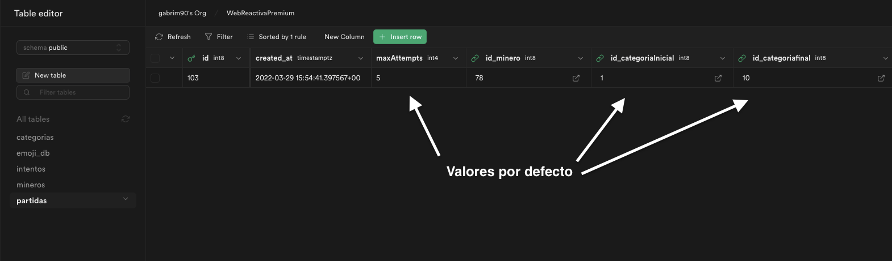
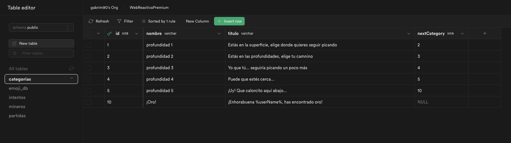
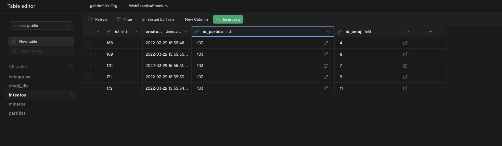
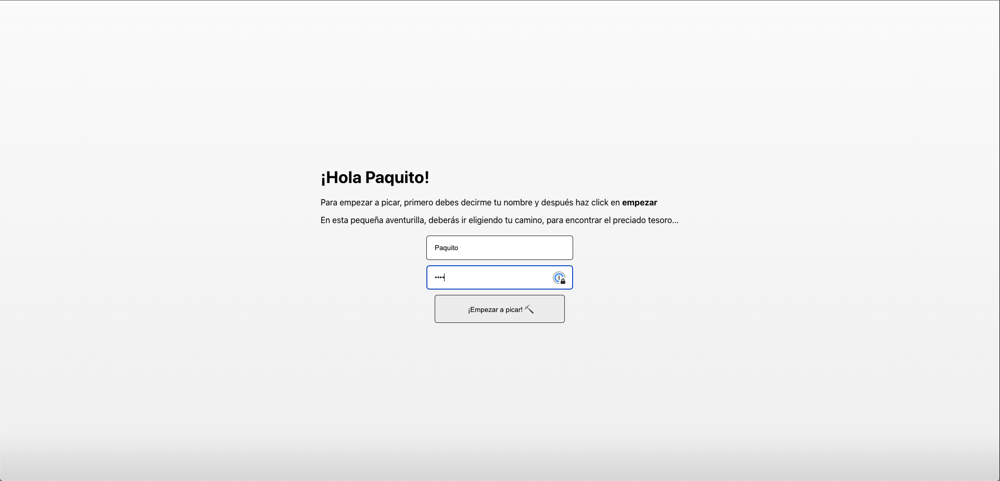
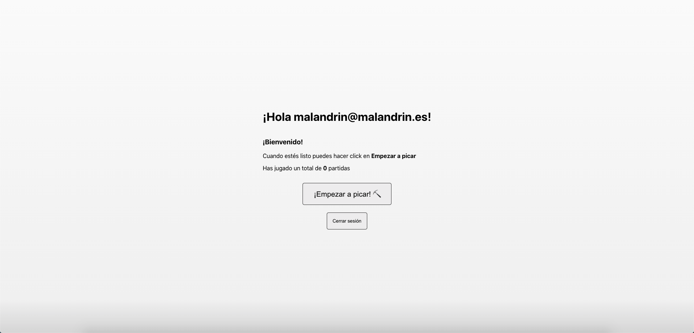
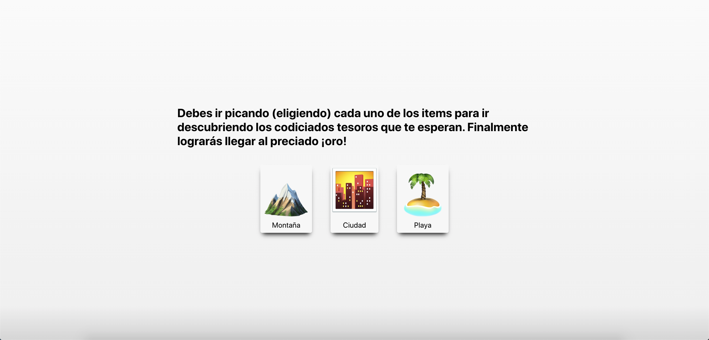
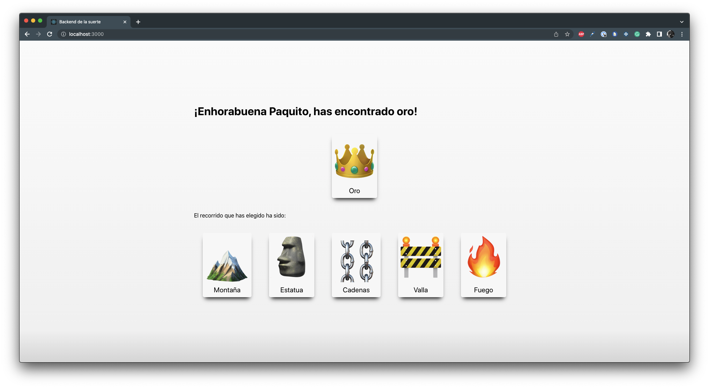

- [Backend de la suerte](#backend-de-la-suerte)
- [Respuestas al desafío](#respuestas-al-desafío)
  - [Desarrollo de la "partida"](#desarrollo-de-la-partida)
- [Detalle de la aplicación](#detalle-de-la-aplicación)
  - [Estructura del Backend](#estructura-del-backend)
    - [Tablas](#tablas)
      - [Partidas](#partidas)
      - [Categorias](#categorias)
      - [Emoji_db](#emoji_db)
      - [Intentos](#intentos)
      - [Gestión de usuarios](#gestión-de-usuarios)
  - [Frontend](#frontend)
    - [Login](#login)
    - [Pantalla inicio](#pantalla-inicio)
    - [Itinerario](#itinerario)
    - [Final](#final)
# Backend de la suerte
La idea para este segundo reto ha sido ir ampliando la aplicación que empecé en el reto 1. Ahora ya tenemos una aplicación más completa, pero con la idea de que siga siendo un **cliente tonto** y que el contenido y las configuraciones principales vengan del **Backend**.

El desarrollo es simple, te registras como un minero (usuario y contraseña) y vas picando (eligiendo) diferentes items hasta que das con el codiciado oro 👑 . Cada nivel que 'picas' te lleva a descubrir nuevos items. Finalmente encuentras la ansiada recompensa y aparece un resumen del itinierario (items escogidos) que has realizado. 

El número de items a picar está predefinido en el backend como se pedía y es fijo para todas las partidas.

Las decisiones no son relevantes, puesto que cuando se elige un item, se almacena como que se ha realizado la acción de picar y se guarda el registro. Independientemente del camino elegido siempre se llega al mismo final. 

Los items que se muestran en cada nivel de profundidad (cada vez que se pica) son configurables desde el Back y el texto que aparece en cada nivel también.

Cada vez que se pica se comprueba el número de registros almacenados y se comprueba si se ha llegado al máximo de la partida.

# Respuestas al desafío
Todo comienza con el registro de un nuevo **minero**, simplemente se recogen sus datos (usuario/contraseña) para registrarlo como usuario en la plataforma y así obtener la **id** para ese minero.

Seguidamente con la **id** del minero se genera una nueva partida. La tabla [Partidas](#partidas) es la que guarda la configuración global de las partidas. En cada **registro** que se añade a la partida hay una **serie de valores de configuración por defecto**, como el número **máximo de items a picar**, la categoría final... etc. 

De esta forma el número de veces que se pica queda predefinido en el **backend**.

Cada vez que se pica se registra en la tabla [Intentos](#intentos) asociados a la partida. 
- Se registra el **timestamp** del instante en el que se ha picado. 
- Se va comprobando el número de registros para esa partida cada vez que se pica con los predefinidos en la configuración de la partida (tabla [Partidas](#partidas)).

Una vez que se llega al final, se muestra el resumen de la partida, con los items elegidos y la opción de volver a empezar.

## Desarrollo de la "partida"
El transcurso de la partida es el siguiente:
1. Se registra o inica sesión el minero
2. Se inicializa la partida. Se crean los valores de configuración, como por ejemplo el nivel máximo que se picará, o la categoría de items inicial. Estos valores son los valores por defecto para la columna dentro de la tabla [Partidas](#partidas).
3. El minero va eligiendo items en distintos niveles de profundidad. Cada nivel de profundidad es una **categoria** que tiene asociada una serie de items (emojis). La configuración de la partidad define cual es la categoría inicial. 
4. El minero "pica" (elige) cada uno de los items, de tal forma que va pasando de categoría, como si fueran niveles de profundidad. 
5. Cada vez que se "pica" en la tabla [Intentos](#intentos) se registra el intento de "picar". Se registra el **timestamp**, el **id del usuario**, **id de la partida** e **id del emoji** que se he apicado. 
6. Se comprueba si el número de intentos registrados coincide con el número de intentos máximo para la partida. Si no coincide se busca la siguiente categoría. 
7. Se vuelve a repetir el proceso (paso 3) hasta que se llega a la categoría final. 
8. Una vez que se ha llegado al máximo número de intentos se muestra la recompensa y se recoge el itinerario seguido a través de los intentos ordenados, por defecto ya vienen ordenados por id, lo cual representa también el orden cronológico. 
9. Se puede volver a empezar la partida.

# Detalle de la aplicación

 ## Estructura del Backend
Para este segundo reto he realizado ya un backend más completo con varias tablas y relaciones.

### Tablas

#### Partidas

Tabla que define los valores de una partida determinada. Define los valores para esa partida, como son:
- Número de intentos
- Id de la categoria inicial (clave externa)
- Id de la categoría final (clave externa)

| campo | tipo | Descripción |
| ------------- | ------------- | ------------- |
| id  | bigint | Id |
| created_at  | timestamp with time zone | Timestamp del registro |
| maxAttempts  | int | Número de intentos para la partida. El valor por defecto de esta columna define el número de veces a picar. |
| id_categoriaInicial  | bigint | **FK**. Categoría (listado de emojis) inicial  |
| id_categoriafinal  | bigint | **FK**. Categoría (listado de emojis) final. Se usa el valor por defecto. |
| id_user  | bigint | **FK**. UUID del usuario. |
  

#### Categorias
Aquí se definen las distintas categorías, se usan como "niveles". 

| campo | tipo | Descripción |
| ------------- | ------------- | ------------- |
| id  | bigint | Id |
| created_at  | timestamp with time zone | Timestamp del registro |
| nombre  | character varying | Nombre de la categoría |
| titulo  | character varying | Mensaje de la categoría que aparece en el front. |
| nextCategory  | int | Siguiente categoría |

#### Emoji_db

Lista de los emojis que aparecen en la aplicación. Cada emoji está asociado a una categoría, de tal forma que se pueden modificar directamente desde el back. 

| campo | tipo | Descripción |
| ------------- | ------------- | ------------- |
| id  | bigint | Id |
| created_at  | timestamp with time zone | Timestamp del registro |
| emoji  | character varying | Carácter para el emoji |
| description  | character varying | Descripción del emoji. |
| categoria  | bigint | **FK**. Id de la categoría a la que pertenece. |

#### Intentos

Aquí se registra cada vez que un minero pica un Item. Se guarda la relación con la partida, que es la que guarda la relación con el usuario. También se guarda la relación con el emoji elegido, para poder mostrar el item que se ha picado. 

| campo | tipo | Descripción |
| ------------- | ------------- | ------------- |
| id  | bigint | Id |
| created_at  | timestamp with time zone | Timestamp del registro |
| id_partida  | int | **FK**. Id de la partida a la que pertenece. |
| id_emoji | int | **FK**. Id del emoji elegido. |

#### Gestión de usuarios

Los usuarios se registran en la plataforma **Supabase** utilizando la API que tiene para ello. Simplemente se crea un usuario mediante un email.

## Frontend

### Login
Pantalla de login donde se registra el minero:

### Pantalla inicio
Antes de empezar a picar y tras el login/registro vemos la siguiente pantalla:

### Itinerario
Cada categoría del itinerario se muestra así:

### Final
Pantalla de final donde se muestra la recompensa y el resumen del camino seguido:

